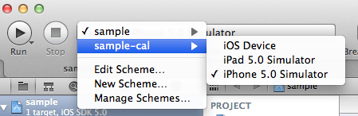

| master  | develop | [versioning](VERSIONING.md) | [license](LICENSE) | [contributing](CONTRIBUTING.md)|
|---------|---------|-----------------------------|--------------------|--------------------------------|
|[](https://travis-ci.org/calabash/calabash-ios)| [](https://travis-ci.org/calabash/calabash-ios-server)| [](http://badge.fury.io/gh/calabash%2Fcalabash-ios) |[](http://opensource.org/licenses/EPL-1.0) | [](https://www.atlassian.com/git/tutorials/comparing-workflows/gitflow-workflow/)|

## Calabash iOS

[http://calaba.sh/](http://calaba.sh/)

Calabash is an automated testing technology for Android and iOS native and hybrid applications.

Calabash is a free-to-use open source project that is developed and maintained by [Xamarin](http://xamarin.com).

While Calabash is completely free, Xamarin provides a number of commercial services centered around Calabash and quality assurance for mobile, namely Xamarin Test Cloud consisting of hosted test-execution environments which let you execute Calabash tests on a large number of Android and iOS devices.  For more information about the Xamarin Test Cloud visit [http://xamarin.com/test-cloud](http://xamarin.com/test-cloud).

## Quick Links

* [Getting Help](https://github.com/calabash/calabash-ios/wiki#getting-help)
* [Reporting Problems](https://github.com/calabash/calabash-ios/wiki#reporting-problems)
* [Public API](http://calabashapi.xamarin.com/ios/)
* [Xamarin Studio + Ruby Client](http://developer.xamarin.com/guides/testcloud/calabash/configuring/)
* [Xamarin Studio + UITest](http://developer.xamarin.com/guides/testcloud/uitest/)
* [Contributing](CONTRIBUTING.md)
* [CHANGELOGS](https://github.com/calabash/calabash-ios/tree/master/changelog)

## Setup and Requirements

Xamarin Studio users should visit [http://developer.xamarin.com/testcloud/](http://developer.xamarin.com/testcloud/) for setup instructions and requirements.

We recommend that you use the most recent released version of Xcode, MacOS, and Ruby.

* MacOS 10.10 or 10.11
* Xcode 6 or 7
* iOS >= 7.1
* ruby >= 2.0 (latest is preferred)

We recommend that you use a managed ruby like [rbenv](https://github.com/sstephenson/rbenv) or [rvm](https://rvm.io/).  For more information, see these Wiki pages:

* [Ruby on MacOS](https://github.com/calabash/calabash-ios/wiki/Ruby-on-MacOS)
* [Best Practice: Never install gems with sudo](https://github.com/calabash/calabash-ios/wiki/Best-Practice%3A--Never-install-gems-with-sudo)

### Alternative Setups

The traditional setup creates a separate Xcode target application that mirrors your original application except that it link to the Calabash server library.  We call this new target the _-cal target._

_Why a separate target?_

>The Calabash server contains symbols and methods that will cause any application that links to it to _be rejected from the AppStore_.  A separate target with a different bundle identifier will ensure that you never accidently submit an application that has the Calabash server linked.

If the separate -cal target does not suit your needs, there are many other ways to setup your project.  The community has collected these alternative methods for integrating Calabash into your Xcode project.

* [Using Xcode Configuration instead of a separate target](http://fangmobile.com/2014/05/08/do-you-love-calabash-ios-but-hate-that-cal-second-target/) Jian Fang and David Siegel
* [Load Calabash dylibs in Debug configuration at runtime](https://github.com/calabash/ios-smoke-test-app/pull/17)
* [CocoaPods](http://angelolloqui.com/blog/25-Acceptance-testing-with-Calabash-and-CocoaPods) Angel G. Olloqui

If you are not already using CocoaPods, we don't recommend adopt CocoaPods just to link the Calabash library.

## Setup: Fast Track

The fast-track instructions are EXPERIMENTAL, but in our experience they work for most iOS projects.

If it doesn't work in your project, see the "Manual setup with Xcode" section below.

Starting in Xcode 6, we've had trouble maintaining the setup tools.  If you have a problem see [calabash-ios setup fails on fresh Xcode 6 project](https://github.com/calabash/calabash-ios/issues/533).

For automatic setup:

1. In a terminal, go to your iOS project
    - `cd path-to-my-ios-project` (i.e. directory containing .xcodeproj file)

2. Install calabash-cucumber gem (this make take some time because of dependencies)
    - `gem install calabash-cucumber`

3. Setup your project for Calabash-iOS.
    - `calabash-ios setup` Answer the questions and read the output :)

4. Generate a skeleton features folder for your tests
    - `calabash-ios gen`

5. In Xcode, build your project using the <project-name>-cal scheme
    - 

6. Run the generated test!
    - `cucumber`

If all goes well, you are now ready to write your first test. Start by editing the file `features/my_first.feature`.

Proceed by reading details about installation below, or moving on to the
[Getting started guide](https://github.com/calabash/calabash-ios/wiki/00-Calabash-iOS-documentation).

## Setup: Manually Create a -cal target

### Background

To use Calabash for iOS in your app, you must do two things: link with our framework: `calabash.framework`, and install a ruby gem as described below. You also need to link with Apple's CFNetwork framework if you are not already using this.

For functional testing with Calabash iOS, you should create a whole separate target by duplicating your production target in Xcode (explained below).

### Ruby and calabash-cucumber gem.

*   Install the `calabash-cucumber` gem. (You may need to do `sudo gem install calabash-cucumber`)

        $ gem install calabash-cucumber
        Successfully installed calabash-cucumber-0.9.47
        1 gem installed
        Installing ri documentation for calabash-cucumber-0.9.47...
        Installing RDoc documentation for calabash-cucumber-0.9.47...


### Setting up Xcode project

Instructions:

* Step 1/3 is to duplicate your primary/production target.
 - Select your project in Xcode and select your production target for your app.
 - Right click (or two-finger tap) your target and select "Duplicate target"
 - Select "Duplicate only" (not transition to iPad)
 - Rename your new target from ".. copy" to "..-cal"
 - From the menu select Edit Scheme and select manage schemes.
 - Rename the new scheme from ".. copy" to "..-cal"
 - Optionally, set the Product name to ..-cal in Build settings for the new target.

* Step 2/3: Link with framework.
    - Download the latest version of calabash.framework with calabash-ios gem command:
    - `calabash-ios download`
    - Use Finder to open the folder that contains `calabash.framework`.
    - Drag `calabash.framework` from Finder into your project's  `Frameworks` folder in Xcode.
        * **Make sure that**
            1. `Copy items into destination group's folder (if needed)` *is checked* and
            2.  _only_ your "-cal " target is checked in `Add to targets`.

      
    - You must also link you -cal target with `CFNetwork.framework` (unless your production target
      is  already linking with `CFNetwork`). To do this click on your -cal target in XCode. Click on
      Build Phases, expand Link Binary with Libraries, click `+` to add `CFNetwork.framework`.


* Step 3/3: cal-Target Build Settings
 - Click on your project and select your new "-cal" target.
 - Select "Build Settings".
 - Ensure that "All" and not "Basic" settings are selected in "build settings".
 - Find "Other Linker Flags" (you can type "other link" in the search field).
 - Ensure that "Other linker flags" contains: `-force_load "$(SRCROOT)/calabash.framework/calabash" -lstdc++`

*Note*: Now that you have created a separate target, new files that you add to your project are not automatically added to your -LP target. Make sure that any new files you add to your production target are also added to your -LP target.


This screenshot is a reference for you build settings.


### Test that `calabash.framework` is loaded.

Make sure you select your "..-cal" scheme and then run you app on 4.x/5 simulator.

Verify that you see console output like

    2012-01-19 LPSimpleExample[4318:11603] Creating the server: <HTTPServer: 0x7958d70>
    2012-01-19 LPSimpleExample[4318:11603] HTTPServer: Started HTTP server on port 37265
    2012-01-19 LPSimpleExample[4318:13903] Bonjour Service Published: domain(local.) type(_http._tcp.) name(Calabash Server)


## Calabash 2.0

Calabash 2.0 is a merge of the iOS and Android APIs.  Read the [Announcement: Calabash 2.0](https://github.com/calabash/calabash/issues/55) for details and to make comments.

## Frank

Calabash can be used as a Frank plug-in for [Frank project](https://github.com/TestingWithFrank/Frank). The idea being to unify the communities more, although full unification will not be possible currently (as Calabash focuses on supporting on-device testing which is not currently a specific design-goal of Frank).  For instructions on how it integrate Calabash into your Frank project see the [README_FRANK.md](README_FRANK.md) document.

## Important notice

The Calabash framework uses private Apple APIs to synthesize touch events. This means that you should double check that `calabash.framework` is not included in the .ipa file you submit to App Store. This is usually done by creating a separate build configuration or target for the version of your app running calabash tests.

An experimental check can be done by the calabash-ios tool

```
    calabash-ios check PATH_TO_IPA_OR_APP
```

This is not guaranteed to work; it is your responsibility to ensure that the framework is properly installed.

## How does automated setup work?

If you're interested in what's going on you can read the installation details here.

Verify that you have installed calabash-cucumber correctly by running `calabash-ios` from the command line:

```
    $ calabash-ios
    Usage: calabash-ios <command-name> [parameters]
    <command-name> can be one of
        help
         prints more detailed help information.
        gen
         generate a features folder structure.
        setup (EXPERIMENTAL) [opt path]?
         setup your XCode project for calabash-ios
      ...
```

When you run `calabash-ios setup` and answer any questions it might ask the following happens:

Note that calabash-ios will backup your project file:

    $ calabash-ios setup
    Checking if Xcode is running...
    ----------Info----------
    Making backup of project file: ~/sample/sample.xcodeproj/project.pbxproj
    ...

The project file is copied to `project.pbxproj.bak`. In case something goes wrong you can move this file back to `project.pbxproj` (in your .xcodeproj) folder.

Setup will modify your xcode project file to use `calabash-ios`. You should now have a new Scheme named [target]-cal in Xcode:


`calabash-ios setup` does the following:

- creates a new -cal target as a copy of your primary target
- add the calabash.framework to your Frameworks folder
- add $(SRCROOT) to framework search path (for that target)
- link with calabash.framework (for that target)
- link with Apple's CFNetwork.framework (for that target)
- set the special `-force_load` and `-lstdc++` linker flags (for that target)

## License

```
Copyright (c) LessPainful APS. All rights reserved.
The use and distribution terms for this software are covered by the
Eclipse Public License 1.0 (http://opensource.org/licenses/eclipse-1.0.php)
which can be found in the file epl-v10.html at the root of this distribution.
By using this software in any fashion, you are agreeing to be bound by
the terms of this license. You must not remove this notice, or any other,
from this software.
```


