| master  | develop | [versioning](VERSIONING.md) | [license](LICENSE) | [contributing](CONTRIBUTING.md)|
|---------|---------|-----------------------------|--------------------|--------------------------------|
|[](https://travis-ci.org/calabash/calabash-ios)| [](https://travis-ci.org/calabash/calabash-ios-server)| [](http://badge.fury.io/gh/calabash%2Fcalabash-ios) |[](http://opensource.org/licenses/EPL-1.0) | [](https://www.atlassian.com/git/tutorials/comparing-workflows/gitflow-workflow/)|

## Calabash iOS

[http://calaba.sh/](http://calaba.sh/)

Calabash is an automated testing technology for Android and iOS native and hybrid applications.

Calabash is a free-to-use open source project that is developed and maintained by [Xamarin](http://xamarin.com).

While Calabash is completely free, Xamarin provides a number of commercial services centered around Calabash and quality assurance for mobile, namely Xamarin Test Cloud consisting of hosted test-execution environments which let you execute Calabash tests on a large number of Android and iOS devices.  For more information about the Xamarin Test Cloud visit [http://xamarin.com/test-cloud](http://xamarin.com/test-cloud).

## Quick Links

* [Getting Help](https://github.com/calabash/calabash-ios/wiki#getting-help)
* [Reporting Problems](https://github.com/calabash/calabash-ios/wiki#reporting-problems)
* [Public API](http://calabashapi.xamarin.com/ios/)
* [Xamarin Studio + Ruby Client](http://developer.xamarin.com/guides/testcloud/calabash/configuring/)
* [Xamarin Studio + UITest](http://developer.xamarin.com/guides/testcloud/uitest/)
* [Contributing](CONTRIBUTING.md)
* [CHANGELOGS](https://github.com/calabash/calabash-ios/tree/master/changelog)

## Setup and Requirements

Xamarin Studio users should visit [http://developer.xamarin.com/testcloud/](http://developer.xamarin.com/testcloud/) for setup instructions and requirements.

We recommend that you use the most recent released version of Xcode, MacOS, and Ruby.

* MacOS 10.10 or 10.11
* Xcode 6 or 7
* iOS >= 7.1
* ruby >= 2.0 (latest is preferred)

We recommend that you use a managed ruby like [rbenv](https://github.com/sstephenson/rbenv) or [rvm](https://rvm.io/).  For more information, see these Wiki pages:

* [Ruby on MacOS](https://github.com/calabash/calabash-ios/wiki/Ruby-on-MacOS)
* [Best Practice: Never install gems with sudo](https://github.com/calabash/calabash-ios/wiki/Best-Practice%3A--Never-install-gems-with-sudo)

### Alternative Setups

If the separate _-cal target_ does not suit your needs, there are many other ways to setup your project.  The community has collected these alternative methods for integrating Calabash into your Xcode project.

* [Using Xcode Configuration instead of a separate target](http://fangmobile.com/2014/05/08/do-you-love-calabash-ios-but-hate-that-cal-second-target/) Jian Fang and David Siegel
* [Load Calabash dylibs in Debug configuration at runtime](https://github.com/calabash/ios-smoke-test-app/pull/17)
* [CocoaPods](http://angelolloqui.com/blog/25-Acceptance-testing-with-Calabash-and-CocoaPods) Angel G. Olloqui

If you are not already using CocoaPods, we don't recommend adopt CocoaPods just to link the Calabash library.

### The -cal Target

The traditional setup creates a separate Xcode target application based on your original application.  We call this new target the _-cal target._  The _-cal target_ is exactly like your original application except that it will contain an embedded Calabash iOS Server.

**Why a separate target?**

The Calabash server contains symbols and methods that will cause any application that links to it to _be rejected from the AppStore_.  A separate target with a different bundle identifier will ensure that you never accidently submit an application that has the Calabash server linked.

### Step 1. Create the -cal Target

Right-click on the Production target and duplicate.

-> 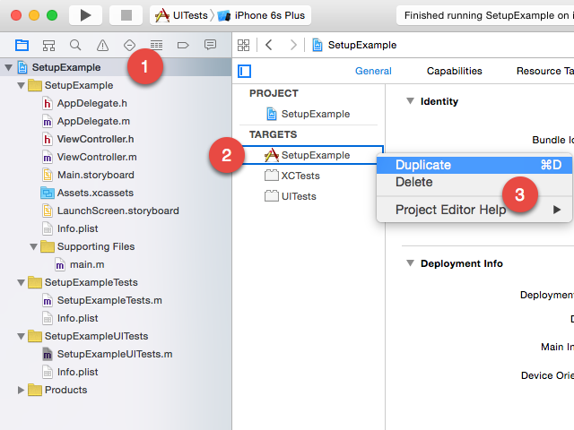 <-


If you have an iPhone or iPad only app, you might see an alert like this one:

-> 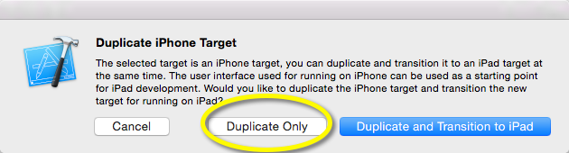 <-

If so, be sure to select "Duplicate Only".

#### 1.2 Rename with -cal

-> 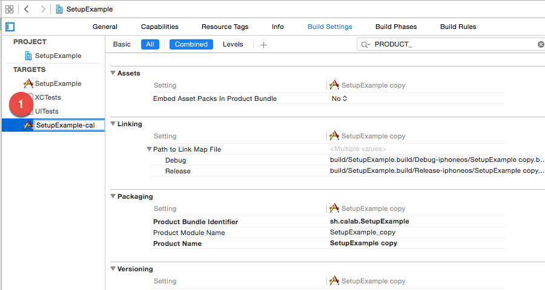 <-

#### 1.3 Change the bundle identifier

-> 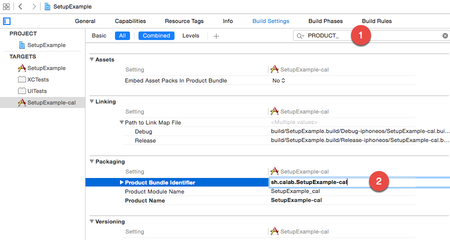 <-

#### 1.4 Change the Info.plist

-> 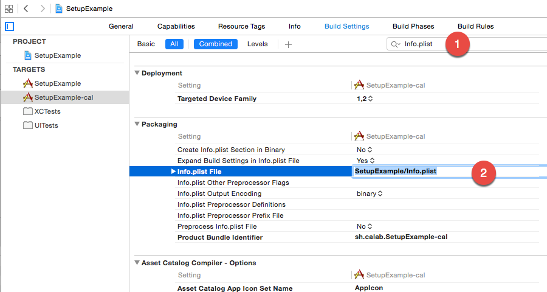 <-


#### 1.5 Delete duplicate Info.plist

-> 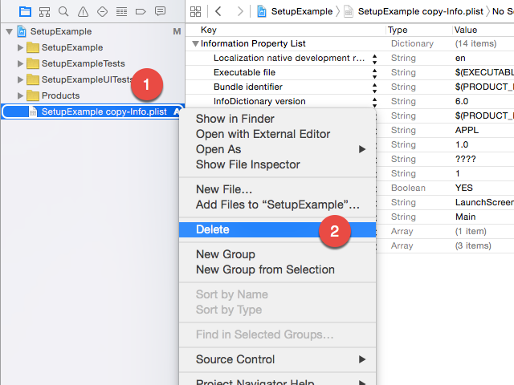 <-

### Step 2:  Create the -cal Scheme

-> 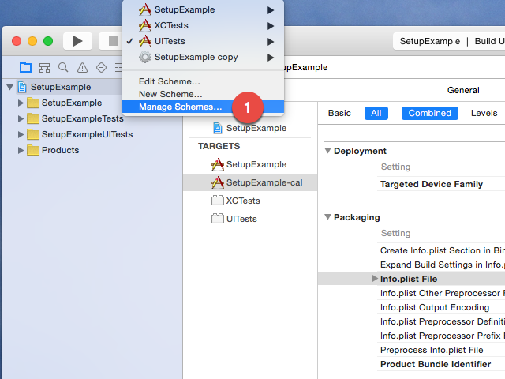 <-

#### 2.2 Set the Scheme name

Be sure to check both the "Show" and "Share" options.

-> 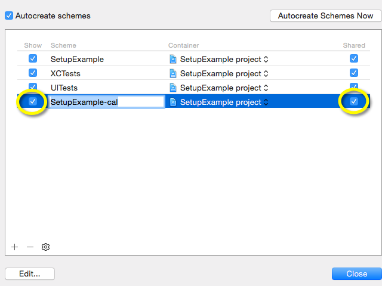 <-

#### 2.3 Set Scheme Executable


This step may not be necessary.  You should confirm that the Executable for the -cal scheme is the -cal target.

-> 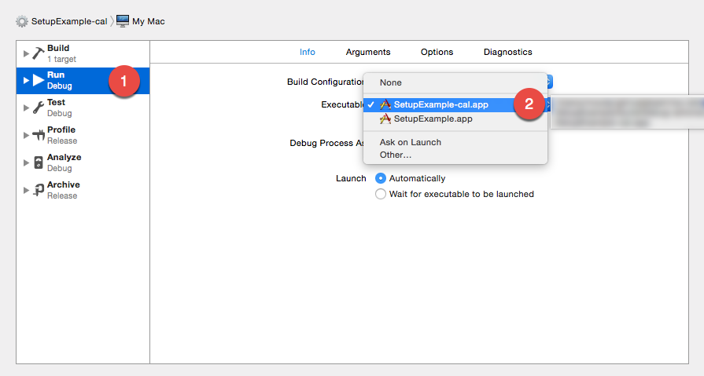 <-

### 3. Link CFNetwork.framework

If your production app does not already link the CFNetwork.framework, you must add it to the -cal target.

-> 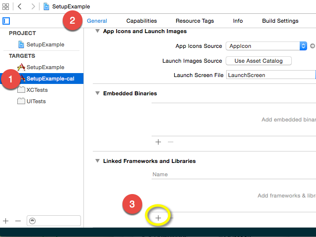 <-

-> 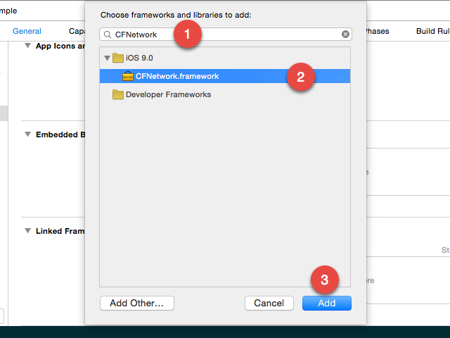 <-

### 4. Link calabash.framework

Create a Gemfile in the same directory as your .xcodeproj:


```
source "https://rubygems.org"

gem "calabash-cucubmer", ">= 0.16", "< 2.0"
```

Then execute the following commands in that directory:

```
$ bundle
$ bundle exec calabash-ios download

----------Info----------
caution: excluded filename not matched:  __MACOSX/*
caution: excluded filename not matched:  calabash.framework/.DS_Store
---------------------------
```


#### 4.2 Add the calabash.framework

Be sure to add the calabash.framework to _no targets_.

-> 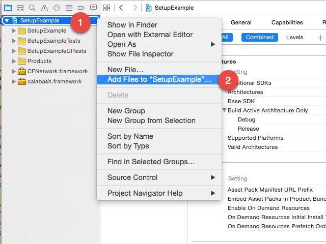 <-

-> 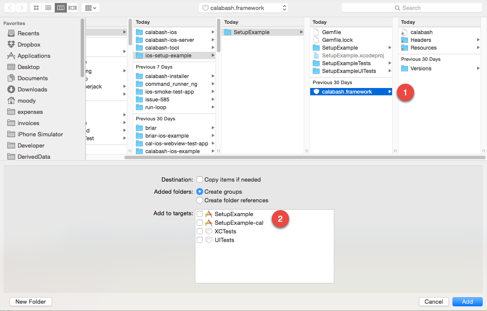 <-

#### 4.3 Link the calabash.framework

->  <-

### 5. Build and Run

Be sure to select the _-cal target_ scheme.  You can target a simulator or physical device.

In your Xcode console you should see the following output - the exact content will differ by Calabash version:

```
2015-10-21 15:44:59.627 DEBUG CalabashServer:222 | Creating the server: <LPHTTPServer: 0x7f80b3d066e0>
2015-10-21 15:44:59.627 DEBUG CalabashServer:223 | Calabash iOS server version: CALABASH VERSION: 0.16.4
2015-10-21 15:44:59.627 DEBUG CalabashServer:226 | App Base SDK: iphonesimulator9.0
```
## Calabash 2.0

Calabash 2.0 is a merge of the iOS and Android APIs.  Read the [Announcement: Calabash 2.0](https://github.com/calabash/calabash/issues/55) for details and to make comments.

## Frank

Calabash can be used as a Frank plug-in for [Frank project](https://github.com/TestingWithFrank/Frank). The idea being to unify the communities more, although full unification will not be possible currently (as Calabash focuses on supporting on-device testing which is not currently a specific design-goal of Frank).  For instructions on how it integrate Calabash into your Frank project see the [README_FRANK.md](README_FRANK.md) document.

## License

```
Copyright (c) LessPainful APS. All rights reserved.
The use and distribution terms for this software are covered by the
Eclipse Public License 1.0 (http://opensource.org/licenses/eclipse-1.0.php)
which can be found in the file epl-v10.html at the root of this distribution.
By using this software in any fashion, you are agreeing to be bound by
the terms of this license. You must not remove this notice, or any other,
from this software.
```


